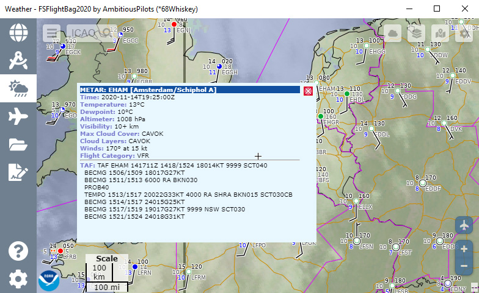

<h1 align="center">FSFlightBag2020</h1>

The Electronic Flight Bag (EFB) for Microsoft Flight Simulator 2020.

  
  
  

 

  

 

## About
**This is your flight companion!** FSFlightBag2020 allows you to view local PDF files, show current weather conditions, view airport diagrams, create a flight plan, follow your aircraft on a map, easily set radio frequencies and autopilot parameters without fiddling with the mouse in the cockpit, take quick notes like tower frequencies, and browse the web, well organized in tabs in a resizable window. 

:point_right: No installation required  
:point_right: View local PDF, image and text files  
:point_right: Global METAR / TAF weather with decoder  
:point_right: Flight planning and tracking  
:point_right: Builtin web browser with video support  
:point_right: Easily control your radio stack and autopilot  
:point_right: Set Baro in hPa or inHG with auto conversion  
:point_right: Scratchpad for quick notes  
:point_right: Borderless mode to save window space  
 

## Instructions
1. Download the latest [FSFlightBag2020](https://github.com/AmbitiousPilots/FSFlightBag2020/releases) release. 
2. Extract the zip file anywhere you like, but make sure the files stay together. 
3. Run FSFlightBag2020 along with Microsoft Flight Simulator. Enjoy! 

***Note:** Make sure [.NET Framework 4.7.2](https://dotnet.microsoft.com/download/dotnet-framework/thank-you/net472-offline-installer) or higher is installed as it's required to run FSFlightBag2020.*
  

## Status & Disclaimer
Please note that this project is in BETA phase. The software is provided "as is" without any warranty of any kind. Use at your own risk. For discussion, questions, remarks, bug reports, feature requests, head on over to the [forum thread](https://forums.flightsimulator.com/).
  

## License
FSFlightBag2020 is provided under the [Creative Commons BY-NC-ND 4.0 License](https://creativecommons.org/licenses/by-nc-nd/4.0/).
